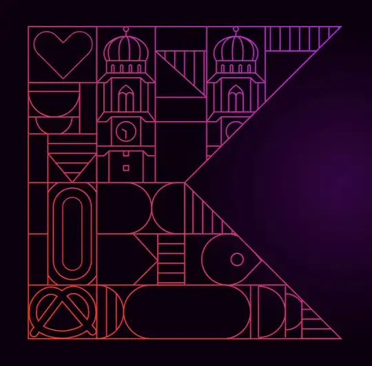

<a href="https://sinasamaki.github.io/KotlinConf26AnimatedLogo/">
  
</a>

# KotlinConf '26 Animated Logo

An animated recreation of the KotlinConf 2026 logo, built with Compose Multiplatform. The logo is drawn entirely in code using Compose's `DrawScope` APIs, no images, just paths, arcs, and curves, and features a looping animation that brings the geometry to life.

This project was created as a companion to my talk at KotlinConf 2026:
**[Drawing with Compose: Beyond the Basics](https://kotlinconf.com/speakers/63282805-74de-414a-aafe-7c9eb392e896/)**

> The original KotlinConf graphic is the property of JetBrains. This project is an independent fan recreation made for educational purposes. I am not affiliated with JetBrains.

## Targets

The app runs on all Compose Multiplatform targets:

| Platform | Entry point |
|----------|-------------|
| Android | `composeApp` Android run configuration |
| iOS | `iosApp` in Xcode |
| Desktop (JVM) | `./gradlew :composeApp:run` |
| Web (WasmJS) | `./gradlew :composeApp:wasmJsBrowserDevelopmentRun` |
| Web (JS fallback) | `./gradlew :composeApp:jsBrowserDevelopmentRun` |

## How it works

The logo geometry lives in `composeApp/src/commonMain/.../logo/`. Each visual element is a separate `DrawScope` extension function with its own file and `@Preview`:

- `DrawBoundary` - the structural grid lines
- `DrawTower` - the central tower with animated clock hands
- `DrawOlympicTrack` - expanding concentric rings
- `OpposingCircles` - two capsule shapes sliding apart
- `DrawHeart` - a heartbeat-scaled heart
- `DrawParallelLines` - animated hatching, clipped to arbitrary shapes
- `DrawPretzel` - a rocking pretzel
- `DrawMascot` - the blinking mascot
- `BottomCapsules` - sliding bottom capsule pair
- `GrowingSemiCircles` - growing arcs stepping through a bounding rect

All animations are driven by a single `progress: Float` (0 to 1, 4 seconds, linear, looping) produced in `KotlinLogo` and passed into each draw function:

```kotlin
val progress = remember { Animatable(0f) }
LaunchedEffect(Unit) {
    while (true) {
        progress.animateTo(
            targetValue = 1f,
            animationSpec = tween(durationMillis = 4000, easing = LinearEasing)
        )
        progress.snapTo(0f)
    }
}
```

Some elements use `oscillateToZero` to create effects that pulse rather than sweep linearly. It maps the 0-to-1 progress through a cosine so the value rises and falls back to zero over a given number of peaks:

```kotlin
fun Float.oscillateToZero(peaks: Int): Float {
    return (1f - cos(2 * peaks * PI.toFloat() * this)) / 2f
}

// usage: the pretzel rocks back and forth 5 times per cycle
rotate(
    degrees = lerp(-4f, 4f, progress.oscillateToZero(5)),
    pivot = Offset(15f, 117f)
) { ... }
```

Shapes are defined as `Path` objects and stroked with a shared gradient brush. A helper function `expandPathCubic` takes any line path and expands it outward by a padding amount with configurable rounded corners, turning a bare line into a capsule, stadium, or custom pill shape:

```kotlin
// a line becomes a capsule
val capsule = expandPathCubic(
    source = Path().apply {
        moveTo(28f, 117f)
        lineTo(58f, 117f)
    },
    padding = 11f,
    cornerRadius = RoundedCornerShape(percent = 50),
)
drawPath(capsule, brush = brush, style = Stroke(width = strokeWidth))
```
